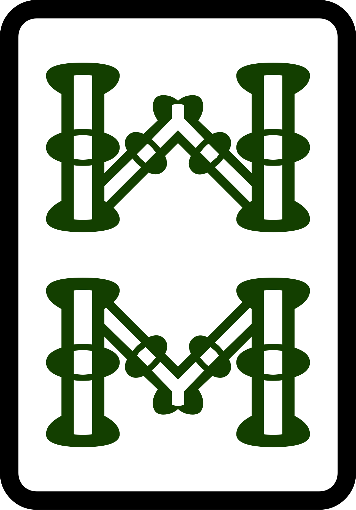
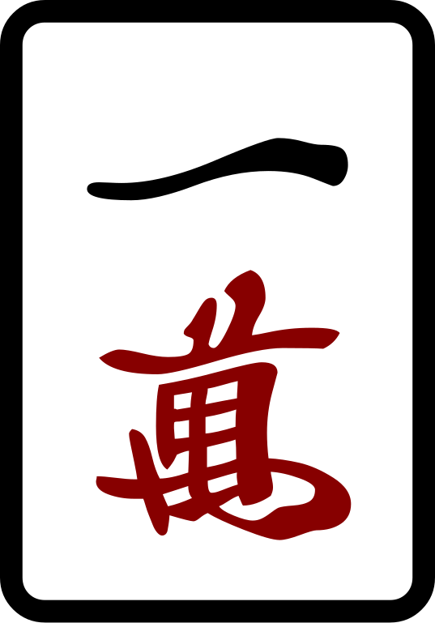
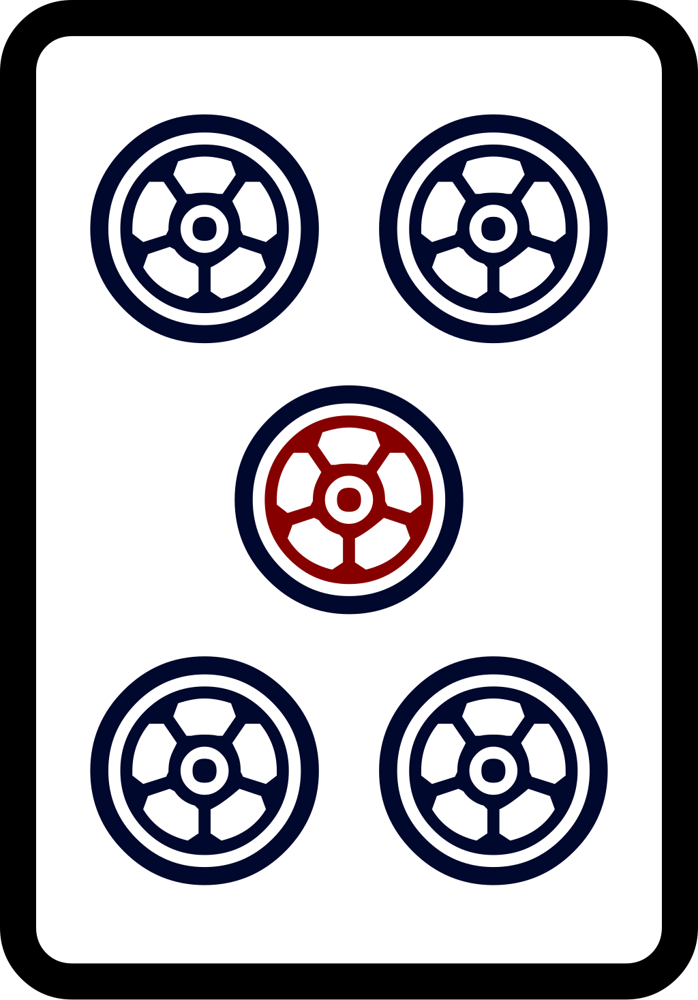

# Kanwisher Lab Mahjong

## Background
Kanwisher Lab Mahjong is mostly cloned and simplified from the Guizhou variation of the Mahjong game. Here we lay out the basic rules, along with some optional rules that might be added to make the game more interesting.

## Objective
Kanwisher Lab Mahjong is a 4-person game. Everyone starts with a number of tokens. 
One game usually lasts 10 minutes. 
During a game, each person has a group of tiles ("牌" in Chinese) in their hands. 
Each person takes turn to draw a tile and discards a tile, until the tile they draw forms a Mahjong with the rest. 
The person having Mahjong first wins the game. 

## Basic Setup

### Suits
There are 108 tiles used in the game: 3 suits, 9 numbers from each suit (1-9), and 4 tiles for each number. 
-   Bam (条): short for "bamboo". Note: the tile ```1-bam``` looks like a bird. 
-  Crack (万/萬): short for "character", since this suit is of Chinese characters. 
-  Dot (筒)

### What is a Mahjong?
A Mahjong ("胡牌" or "和牌") is a group of 14 tiles with which a player wins the game, consisting of a pair plus 4 groups.

A *pair* is 2 identical tiles, such as ```2-bam``` + ```2-bam```

A group can either be a *triplet* (3 identical tiles) or 3 a *straight* (3 consecutively-numbered tiles) of the same suit. 
For example, a group can be ```3-bam``` + ```3-bam``` + ```3-bam``` (triplet), or ```5-dot``` + ```6-dot``` + ```7-dot``` (straight). A straight cannot be ```8-crack``` + ```9-crack``` + ```1-crack```.  


## Gameplay (basic version)
### Initializing
- Each player starts 13 tiles. The player who won the previous game gets 14 tiles and starts the new game.
- The remaining 55 tiles are faced down and form the pile deck.
- The game goes in the counterclockwise direction: the person to the right of the current player is the next to play.

### During a turn
- The player draws a pile from the pile deck and hence has 14 piles in their hand.
- If their hand forms a Mahjong, the game ends. If not, the player discards a pile facing up to the discard area.

### Pausing the game and putting down tiles
- When a player has discarded a pile to the discard area, any player can *pause the game* if the pile just discarded can form a triplet with 2 tiles in their hand. Pausing for straights is not allowed. 
- If they choose to do so, they *put down* the tile and the 2 tiles in their hand in front of them, facing up. 
    - For example, if Player A has just discarded a ```9-bam```, and Player C has two ```9-bam``` in their hand, Player C can pause the game, grab the ```9-bam``` Player A discarded, and put it down in front of them along with the two ```9-bam``` in front of them facing up.
- The 3 tiles that are put down are still counted as in the player's hand, despite being faced up in front of them.
- Then, the player discards a tile from their hand to the discard pile.
- The person to the right of the player who just paused starts the next turn.
    - For example, if the game goes A -> B -> C -> D, Player A discards a pile and Player C pauses the game and puts 3 tiles down, Player D starts the next turn.

### Pausing for Mahjong
- A player can also pause if the tile another player has just discarded forms a triplet or a pair with tiles in their hand, *and* the resulting 14 tiles forms a Mahjong.
- Still, one cannot pause a game for a straight, even if the resulting straight forms a Mahjong.
